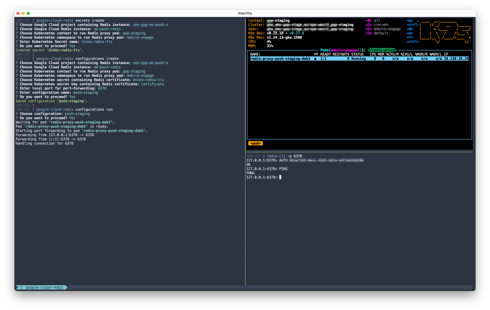

:toc: macro
:toc-title:
:toclevels: 10

= ⛅ google-cloud-redis

image:https://img.shields.io/github/package-json/v/edosrecki/google-cloud-redis-cli/main?color=blue&label=google-cloud-redis["google-cloud-redis CLI Version"]
image:https://img.shields.io/github/actions/workflow/status/edosrecki/google-cloud-redis-cli/continuous-integration.yml["Build Status", link="https://github.com/edosrecki/google-cloud-redis-cli/actions"]

A CLI app which establishes a connection to a private Google Cloud Redis instance and port-forwards it to a local machine.

Connection is established by running an https://www.stunnel.org/[stunnel] pod in a Google Kubernetes Engine cluster which runs in the same VPC network as the private Cloud Redis instance. Connection is then port-forwarded to the local machine, where a user can connect to the instance on localhost. Configurations in the app can be saved for practical future usage.

The app relies on local `gcloud` and `kubectl` commands which have to be configured and authenticated with the proper Google Cloud user and GKE Kubernetes cluster.

The app also needs an existing Kubernetes Secret containing the Google Cloud Redis certificate to exist in the Kubernetes 
cluster. You can download a Redis certificate file and create a Kubernetes secret manually, or you can use
`google-cloud-redis secrets create` command to do so.

---

toc::[]

== Install
=== Homebrew
[source,bash]
----
brew install edosrecki/tools/google-cloud-redis

# Update
brew upgrade google-cloud-redis
----

=== Releases
Download a corresponding distribution from https://github.com/edosrecki/google-cloud-redis-cli/releases[Releases] and add
the executable to your `PATH`.

=== Build from source
Build the app from source by building and packaging it manually: see _Build_ and
_Package_ sections.

== Use
=== Prerequisites
* Install https://cloud.google.com/sdk/docs/install[`gcloud`] tool
* Install https://kubernetes.io/docs/tasks/tools/#kubectl[`kubectl`] tool
* Authenticate to Google Cloud: `gcloud auth login`
* Get GKE cluster credentials: `gcloud container clusters get-credentials`
* Download Google Cloud Redis certificate and store it in a Kubernetes secret (see `google-cloud-redis secrets create`).

=== Run
[source,bash]
----
# Help
google-cloud-redis help

# Create Kubernetes secret containing Gogle Cloud Redis certificate
google-cloud-redis secrets create

# Create (or override existing) configuration
google-cloud-redis configurations create

# Run configuration (interactive mode)
google-cloud-redis configurations run
# Run configuration (non-interactive mode)
google-cloud-redis configurations run $NAME
# HINT: Add alias
alias myDbProd="google-cloud-redis configurations run $NAME"

## Connect to the instance on localhost
redis-cli -p $LOCAL_PORT

# Export configurations (and share :-])
cat $(google-cloud-redis configurations path)
----

== Build
[source,bash]
----
npm run clean
npm run build
----

== Package
=== Pre-configured
Package the app for Node.JS 16 on MacOS, Linux, and Windows.

[source,bash]
----
npm run bundle
----

=== Manual
See https://www.npmjs.com/package/pkg#targets[pkg] for details.

[source,bash]
----
npx pkg <NODE_RANGE>-<PLATFORM>-<ARCH>
----

== Deploy
To deploy a new version of `google-cloud-redis` app, manually run a https://github.com/edosrecki/google-cloud-redis-cli/actions/workflows/continuous-deployment.yml["Continuous Deployment"] worklow in GitHub Actions.
